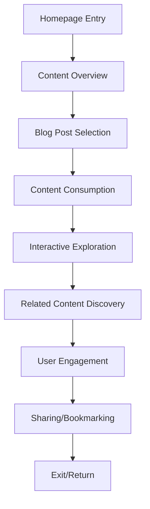
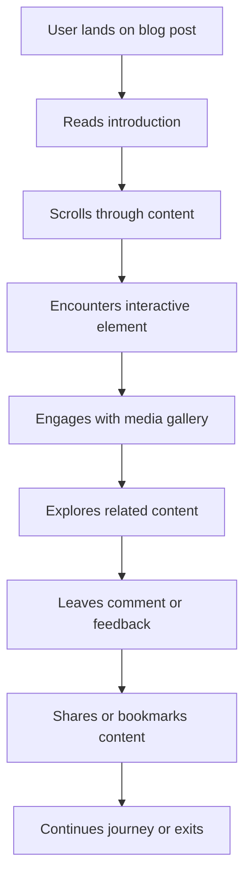
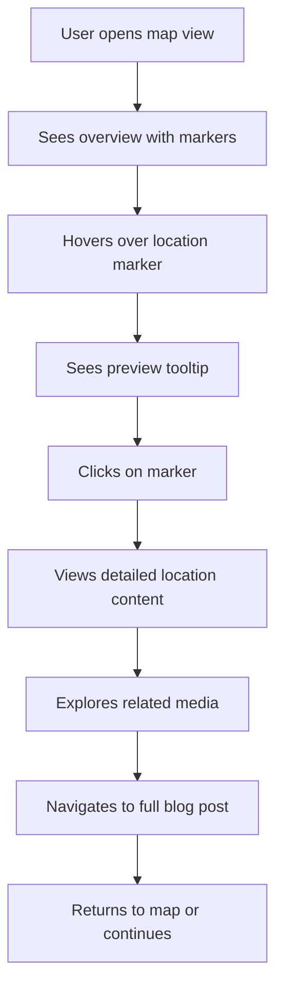
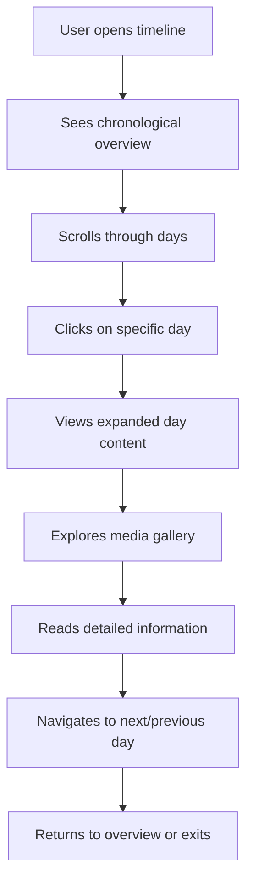
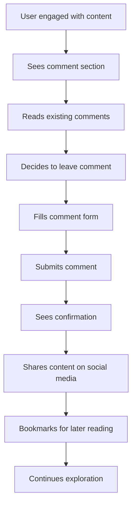

# TravelBlog Implementation Guide

## Overview

This comprehensive implementation guide provides a detailed roadmap for developing the TravelBlog platform, aligning with the existing specification documents and requirements. The guide covers component breakdown, feature prioritization, user interaction flowcharts, content loading strategy, and testing criteria.

## Table of Contents

1. [Component Breakdown](#1-component-breakdown)
2. [Feature Prioritization](#2-feature-prioritization)
3. [User Interaction Flowcharts](#3-user-interaction-flowcharts)
4. [Content Loading Strategy](#4-content-loading-strategy)
5. [Testing Criteria and Success Metrics](#5-testing-criteria-and-success-metrics)

## 1. Component Breakdown

### 1.1 Reusable UI Elements

#### 1.1.1 Cards
- **Structure**: Blog cards with featured image, title, metadata, excerpt, and CTA
- **Functionality**: Hover effects, click navigation, bookmarking, sharing
- **Variants**:
  - Blog post cards (250px height, var(--color-sand) title)
  - Journey day cards (timeline integration, expandable content)
  - Feature cards (hero sections, prominent display)

#### 1.1.2 Navigation Bars
- **Structure**: Header navigation with logo, menu items, search, and user actions
- **Functionality**:
  - Sticky positioning for persistent access
  - Mobile-responsive hamburger menu
  - Dropdown menus for content categories
  - Active state indicators

#### 1.1.3 Interactive Maps
- **Structure**: SVG-based geographical map with location markers
- **Functionality**:
  - Click interactions for location details
  - Hover previews with location information
  - Zoom and pan capabilities
  - Filter by theme/location type
  - Journey route visualization

#### 1.1.4 Timelines
- **Structure**: Horizontal/vertical timeline with day markers and content sections
- **Functionality**:
  - Scroll-based navigation
  - Expandable day sections
  - Interactive progress indicators
  - Media gallery integration
  - Responsive layout adaptation

#### 1.1.5 Media Galleries
- **Structure**: Masonry grid layout with lightbox functionality
- **Functionality**:
  - Click-to-expand lightbox view
  - Swipe/gesture support for mobile
  - Zoom capabilities for detailed inspection
  - Caption display with contextual information
  - Lazy loading for performance

### 1.2 Component Structure and Functionality

#### 1.2.1 Blog Post Component
```html
<article class="blog-post">
    <header class="post-header">
        <h1 class="post-title">Post Title</h1>
        <div class="post-meta">
            <span class="post-date">Date</span>
            <span class="post-author">Author</span>
            <span class="post-tags">Tags</span>
        </div>
    </header>
    
    <section class="post-content">
        <figure class="featured-image">
            
            <figcaption>Image caption</figcaption>
        </figure>
        
        <div class="text-content">
            <p>Content with <em>emphasis</em> and <strong>strong</strong> elements</p>
            <blockquote class="pull-quote">
                <p>Important quote</p>
                <footer>— Author</footer>
            </blockquote>
        </div>
    </section>
    
    <footer class="post-footer">
        <div class="related-posts">Related content links</div>
        <div class="post-navigation">Prev/Next links</div>
    </footer>
</article>
```

#### 1.2.2 Interactive Map Component
```html
<div class="interactive-map">
    <svg viewBox="0 0 1000 800" class="map-svg">
        <g class="map-base">
            <!-- Base map paths -->
        </g>
        <g class="map-locations">
            <circle class="location-marker" data-location="puri" cx="300" cy="400" r="8">
                <title>Puri Jagannath Temple</title>
            </circle>
            <!-- Additional location markers -->
        </g>
        <g class="map-route">
            <path class="journey-route" d="M300,400 L500,300 L700,450"></path>
        </g>
    </svg>
    
    <div class="map-controls">
        <button class="zoom-in">+</button>
        <button class="zoom-out">-</button>
        <div class="map-legend">
            <!-- Legend items -->
        </div>
    </div>
    
    <div class="location-details">
        <div class="location-content">
            <h3>Location Title</h3>
            <p>Location description and content</p>
            <a href="/location" class="explore-link">Explore More</a>
        </div>
    </div>
</div>
```

### 1.3 Component Interaction Patterns

#### 1.3.1 Card Interactions
- **Hover**: Elevate card with shadow (transform: translateY(-10px), box-shadow enhancement)
- **Click**: Smooth transition to detailed view (CSS transition: all 0.4s ease-out)
- **Bookmark**: Toggle bookmark state (heart icon animation, localStorage persistence)
- **Share**: Open share modal with platform options (social media integration)

#### 1.3.2 Timeline Navigation
- **Scroll**: Horizontal timeline navigation (overflow-x: auto, scroll-snap-type: x mandatory)
- **Click**: Expand day details (toggle class "expanded", CSS transition for height)
- **Hover**: Preview content snippet (opacity transition, transform scale)
- **Drag**: Manual timeline navigation (touch-event handling, drag gesture support)

#### 1.3.3 Map Interactions
- **Click**: Location details display (event delegation for markers, content loading)
- **Hover**: Location preview (tooltip display with CSS transform and opacity)
- **Zoom**: Detailed exploration (SVG viewBox manipulation, transform scale)
- **Filter**: Content by theme (CSS class toggling, content filtering)

## 2. Feature Prioritization

### 2.1 MVP (Minimum Viable Product) Features

#### 2.1.1 Core Content Presentation
- **Blog Post Display**: Basic article structure with title, content, and images
- **Responsive Layout**: Mobile-first design with breakpoint adaptation
- **Basic Navigation**: Header menu with essential links
- **Content Cards**: Grid layout for blog post previews
- **Typography System**: Cinzel headings, Lato body text with proper hierarchy

#### 2.1.2 Essential Interactions
- **Basic Hover Effects**: Visual feedback on interactive elements
- **Smooth Scrolling**: Anchor link navigation with smooth behavior
- **Content Reveals**: Progressive disclosure of additional content
- **Loading States**: Basic spinner indicators for content loading
- **Form Validation**: Client-side validation for contact forms

#### 2.1.3 Fundamental Performance
- **Lazy Loading**: Images and non-critical content
- **CSS/JS Minification**: Basic build optimization
- **Critical CSS**: Above-the-fold styling
- **Image Compression**: WebP format with quality optimization
- **Caching Strategy**: Basic browser caching for static assets

#### 2.1.4 Accessibility Basics
- **Semantic HTML**: Proper use of HTML5 elements
- **Keyboard Navigation**: Basic tab order and focus states
- **Color Contrast**: Minimum 4.5:1 contrast ratio
- **Alt Text**: Descriptive alternatives for images
- **ARIA Landmarks**: Basic role attributes for screen readers

### 2.2 Enhanced Features (Post-MVP)

#### 2.2.1 Advanced Content Features
- **Scrollytelling Sections**: Parallax with animated text reveal
- **Interactive Timelines**: Horizontal navigation with expandable days
- **360° Media Views**: Virtual tours of temple interiors
- **Before/After Sliders**: Historical comparisons
- **Audio Integration**: Mantras and ambient sounds

#### 2.2.2 Enhanced Interactions
- **Custom Cursor**: Enhanced pointer with interactive elements
- **Advanced Animations**: Complex motion patterns and transitions
- **Interactive Maps**: Geographical exploration with content integration
- **Modal Systems**: Overlay content with smooth transitions
- **Drag-and-Drop**: User-controlled content manipulation

#### 2.2.3 Performance Optimization
- **Progressive Loading**: Incremental content display
- **Code Splitting**: Dynamic import for JavaScript modules
- **Font Loading Optimization**: WOFF2 with subset fonts
- **Advanced Caching**: Service worker implementation
- **Resource Preloading**: Critical resource prioritization

#### 2.2.4 Advanced Accessibility
- **Motion Preferences**: Respect user motion settings
- **High Contrast Mode**: Enhanced visibility options
- **Screen Reader Optimization**: Advanced ARIA attributes
- **Keyboard Shortcuts**: Efficient navigation options
- **Language Detection**: Multilingual support

### 2.3 Implementation Timeline

#### 2.3.1 Phase 1: Foundation (Weeks 1-4)
- **Week 1-2**: HTML structure and semantic markup
- **Week 3**: CSS base styles and typography system
- **Week 4**: Basic JavaScript functionality and interactions

#### 2.3.2 Phase 2: Core Features (Weeks 5-8)
- **Week 5-6**: Blog post templates and content integration
- **Week 7**: Navigation patterns and user flow
- **Week 8**: Basic interactive components (cards, timelines)

#### 2.3.3 Phase 3: Enhanced Features (Weeks 9-12)
- **Week 9-10**: Advanced animations and transitions
- **Week 11**: Interactive maps and media integration
- **Week 12**: Performance optimization and testing

#### 2.3.4 Phase 4: Polish & Launch (Weeks 13-16)
- **Week 13**: Micro-interactions and feedback mechanisms
- **Week 14**: Accessibility enhancements and testing
- **Week 15**: Cross-browser testing and bug fixes
- **Week 16**: Final deployment and monitoring setup

## 3. User Interaction Flowcharts

### 3.1 Main User Journey



### 3.2 Blog Post Interaction Flow



### 3.3 Interactive Map Flow



### 3.4 Timeline Navigation Flow



### 3.5 Engagement Touchpoints Flow



## 4. Content Loading Strategy

### 4.1 Progressive Loading Approach

#### 4.1.1 Critical Content First
- **Above-the-fold content**: Load immediately (inline critical CSS)
- **Primary navigation**: Essential menu items and branding
- **Hero section**: Main visual introduction
- **Initial blog cards**: First 3-4 visible cards in grid

#### 4.1.2 Secondary Content Deferred
- **Below-the-fold content**: Load after initial render
- **Additional blog cards**: Lazy load as user scrolls
- **Media galleries**: Load placeholders first, then full content
- **Interactive elements**: Initialize after core content loaded

#### 4.1.3 Tertiary Content On-Demand
- **Related content**: Load when user reaches end of post
- **Comments section**: Load when user scrolls into view
- **Detailed maps**: Load when user interacts with map element
- **Advanced animations**: Initialize after all content loaded

### 4.2 Technical Implementation

#### 4.2.1 Lazy Loading Strategy
```javascript
// Intersection Observer for lazy loading
document.addEventListener('DOMContentLoaded', function() {
    const lazyLoad = function() {
        const observer = new IntersectionObserver((entries) => {
            entries.forEach(entry => {
                if (entry.isIntersecting) {
                    const img = entry.target;
                    img.src = img.dataset.src;
                    img.classList.add('loaded');
                    observer.unobserve(img);
                }
            });
        }, { threshold: 0.1 });

        // Observe all lazy images
        const lazyImages = document.querySelectorAll('img[data-src]');
        lazyImages.forEach(img => observer.observe(img));

        // Observe lazy components
        const lazyComponents = document.querySelectorAll('.lazy-component');
        lazyComponents.forEach(component => observer.observe(component));
    };

    // Initialize lazy loading
    lazyLoad();
});
```

#### 4.2.2 Progressive Image Loading
```html
<!-- Progressive image loading pattern-->
<div class="image-container">
    
    <div class="image-loader">Loading...</div>
</div>

<style>
.lazy-image {
    opacity: 0;
    transition: opacity 0.3s ease-out;
}

.lazy-image.loaded {
    opacity: 1;
}

.image-loader {
    position: absolute;
    top: 50%;
    left: 50%;
    transform: translate(-50%, -50%);
}
</style>
```

### 4.3 Media Loading Optimization

#### 4.3.1 Image Optimization
- **Format**: WebP with fallback to JPEG/PNG
- **Compression**: 75% quality for photographs, 85% for graphics
- **Responsive**: srcset with multiple resolutions (1x, 2x)
- **Dimensions**: Predefined sizes to prevent layout shifts
- **Lazy Loading**: Native lazy loading with fallback

#### 4.3.2 Video Optimization
- **Format**: MP4 (H.264) with WebM fallback
- **Compression**: CRF 23-28 for balance of quality and size
- **Poster Images**: Custom thumbnails (50-100KB)
- **Autoplay**: Disabled (user-initiated only)
- **Controls**: Custom styled with accessibility features

#### 4.3.3 Interactive Media
- **360° Views**: Progressive loading with quality levels
- **Before/After Sliders**: Optimized image pairs
- **Audio Players**: Streaming with buffering indicators
- **Interactive Maps**: SVG with optimized paths

### 4.4 Performance Monitoring

#### 4.4.1 Loading Metrics
- **First Contentful Paint**: Target < 1.5s
- **Largest Contentful Paint**: Target < 2.5s
- **Time to Interactive**: Target < 3.5s
- **Total Blocking Time**: Target < 200ms

#### 4.4.2 Resource Optimization
- **Image Budget**: < 500KB total for above-the-fold
- **CSS Budget**: < 50KB (minified)
- **JS Budget**: < 100KB (minified, initial load)
- **Font Budget**: < 100KB (WOFF2, subset)

#### 4.4.3 Monitoring Tools
- **Lighthouse**: Regular performance audits
- **Web Vitals**: Core metrics monitoring
- **Resource Timing API**: Asset loading analysis
- **Performance Observer**: Runtime performance tracking

## 5. Testing Criteria and Success Metrics

### 5.1 Component Testing Criteria

#### 5.1.1 Blog Post Component
- **Render Test**: Correct HTML structure and content display
- **Responsive Test**: Proper adaptation across breakpoints
- **Typography Test**: Correct font hierarchy and readability
- **Media Test**: Image loading and display verification
- **Accessibility Test**: Semantic structure and ARIA attributes

#### 5.1.2 Interactive Map Component
- **Render Test**: SVG map displays correctly
- **Interaction Test**: Click and hover responses work
- **Zoom Test**: Zoom functionality operates smoothly
- **Filter Test**: Location filtering works as expected
- **Performance Test**: Smooth animation at 60fps

#### 5.1.3 Timeline Component
- **Render Test**: Timeline structure displays correctly
- **Scroll Test**: Horizontal scrolling works smoothly
- **Expand Test**: Day expansion functionality works
- **Navigation Test**: Next/previous day navigation
- **Responsive Test**: Mobile adaptation works properly

### 5.2 Feature Testing Criteria

#### 5.2.1 Core Features
- **Content Loading**: All content loads without errors
- **Navigation**: All links and buttons work correctly
- **Responsive Design**: Layout adapts to all screen sizes
- **Accessibility**: Keyboard navigation and screen reader support
- **Performance**: Meets defined performance benchmarks

#### 5.2.2 Interactive Features
- **Hover Effects**: Visual feedback on all interactive elements
- **Animations**: Smooth transitions at 60fps
- **Modals**: Proper open/close functionality
- **Forms**: Validation and submission work correctly
- **Media**: All media types load and play properly

#### 5.2.3 Advanced Features
- **Custom Cursor**: Follows mouse accurately
- **Parallax Effects**: Smooth scrolling performance
- **Interactive Maps**: All interactions work correctly
- **Timeline Navigation**: Smooth scrolling and expansion
- **Lazy Loading**: Content loads at appropriate times

### 5.3 Success Metrics

#### 5.3.1 Performance Metrics
- **Lighthouse Score**: > 90 for Performance, Accessibility, Best Practices
- **Web Vitals**: Good scores for LCP, FID, CLS
- **Load Time**: < 2.5s for main content
- **Error Rate**: < 1% of user sessions
- **Frame Rate**: 60fps for all animations

#### 5.3.2 User Engagement Metrics
- **Time on Page**: > 3 minutes average
- **Scroll Depth**: > 75% completion rate
- **Bounce Rate**: < 30% for content pages
- **Return Rate**: > 20% returning visitors
- **Interaction Rate**: > 15% of users engage with interactive elements

#### 5.3.3 Business Metrics
- **Sharing Rate**: > 15% content amplification
- **Conversion Rate**: > 5% for key actions (comments, bookmarks)
- **Growth Rate**: > 10% monthly user growth
- **Retention Rate**: > 30% monthly active users
- **Content Consumption**: > 2 pages per session

#### 5.3.4 Technical Metrics
- **Uptime**: > 99.9% availability
- **Error Rate**: < 0.1% of requests
- **API Response Time**: < 300ms average
- **CDN Cache Hit Ratio**: > 90%
- **Resource Load Time**: < 1s for critical assets

### 5.4 Testing Methodology

#### 5.4.1 Automated Testing
- **Unit Tests**: Jest for JavaScript functionality
- **Integration Tests**: Component interaction verification
- **Visual Regression**: Screenshot comparison for UI consistency
- **Performance Tests**: Lighthouse and WebPageTest automation
- **Accessibility Tests**: axe-core and pa11y automation

#### 5.4.2 Manual Testing
- **Cross-Browser Testing**: Chrome, Firefox, Safari, Edge
- **Device Testing**: Mobile, tablet, desktop verification
- **User Testing**: Real user feedback sessions
- **Accessibility Testing**: Screen reader and keyboard navigation
- **Performance Testing**: Network throttling and CPU simulation

#### 5.4.3 Continuous Monitoring
- **Error Tracking**: Sentry or similar tools
- **Performance Monitoring**: Real User Monitoring (RUM)
- **User Analytics**: Google Analytics or similar
- **Feedback Collection**: User surveys and contact forms
- **A/B Testing**: Feature variation testing

## Conclusion

This implementation guide provides a comprehensive framework for developing the TravelBlog platform, ensuring alignment with the spiritual and cultural depth of the Odisha Sacred Odyssey content while maintaining technical excellence. The guide covers all aspects from component breakdown to testing criteria, creating a solid foundation for successful implementation.

### Key Implementation Principles

1. **User-Centric Design**: All components and features prioritize user experience
2. **Performance Focus**: Consistent emphasis on speed and efficiency
3. **Accessibility Compliance**: Full WCAG 2.1 AA compliance throughout
4. **Cultural Integration**: Deep alignment with spiritual and cultural themes
5. **Technical Excellence**: Modern web standards and best practices

### Next Steps

1. **Review & Approval**: Stakeholder review of implementation guide
2. **Development Planning**: Detailed sprint planning and task breakdown
3. **Phase Implementation**: Sequential development following the roadmap
4. **Testing & QA**: Comprehensive testing across all scenarios
5. **Launch & Monitor**: Deployment with continuous performance monitoring