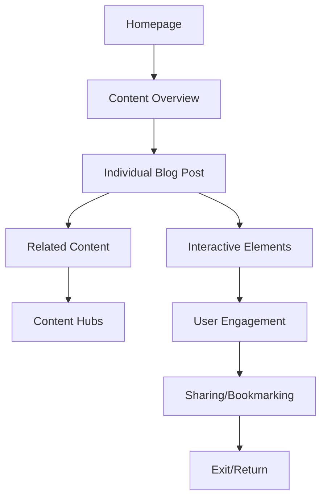

# Interactive Experience Requirements

## Overview
This document defines the interactive elements and user journey for the TravelBlog platform, focusing on creating an engaging, intuitive, and spiritually meaningful experience. The specifications are designed to enhance user engagement while maintaining the sacred and cultural integrity of the content.

## 1. User Journey Mapping

### 1.1 Entry Points
- **Homepage Hero**: Primary entry with spiritual invocation
- **Content Hubs**: Thematic entry points (Temples, Food, History)
- **Search Results**: Contextual entry from search queries
- **External Links**: Social media and referral traffic

### 1.2 Navigation Flow


### 1.3 Exit Points
- **Completion**: End of content journey
- **Sharing**: Social media and external platforms
- **Bookmarking**: Save for later reading
- **Conversion**: Newsletter signup or donation

## 2. Interactive Elements

### 2.1 Hover Effects
- **Card Hover**: Elevation and shadow enhancement
- **Text Hover**: Color transition and underline animation
- **Image Hover**: Zoom and overlay effects
- **Button Hover**: Background color shift and scale

### 2.2 Click Reveals
- **Expandable Sections**: Toggle content visibility
- **Accordions**: Organized information disclosure
- **Modal Windows**: Detailed content overlays
- **Tooltip Information**: Contextual help and definitions

### 2.3 Scroll Animations
- **Parallax Effects**: Depth perception enhancement
- **Reveal Animations**: Content fade-in on scroll
- **Progress Indicators**: Reading progress visualization
- **Sticky Elements**: Persistent navigation and calls-to-action

## 3. Content-Specific Interactions

### 3.1 Blog Cards
- **Hover**: Elevate card with shadow and border highlight
- **Click**: Smooth transition to detailed view
- **Bookmark**: Save for later reading
- **Share**: Social media integration

### 3.2 Timeline Sections
- **Scroll**: Horizontal timeline navigation
- **Click**: Expand day details
- **Hover**: Preview content snippet
- **Drag**: Manual timeline navigation

### 3.3 Map Integration
- **Click**: Location details and content
- **Hover**: Location preview
- **Zoom**: Detailed geographical exploration
- **Filter**: Content by theme/location

### 3.4 Media Galleries
- **Click**: Lightbox view with navigation
- **Swipe**: Mobile-friendly gesture support
- **Zoom**: Detailed image inspection
- **Caption**: Contextual information display

## 4. Transitions & Animations

### 4.1 Page Transitions
- **Fade**: Smooth content transitions
- **Slide**: Horizontal/vertical content movement
- **Zoom**: Content scaling effects
- **Morph**: Shape transformation animations

### 4.2 Element Transitions
- **Color**: Smooth color transitions
- **Size**: Scaling animations
- **Position**: Movement animations
- **Opacity**: Fade effects

### 4.3 Loading States
- **Spinner**: Visual loading indicators
- **Progress Bar**: Content loading progress
- **Skeleton**: Placeholder content during load
- **Transition**: Smooth state changes

## 5. Progress Indicators

### 5.1 Reading Progress
- **Scroll Bar**: Custom styled progress indicator
- **Percentage**: Numerical progress display
- **Visual**: Graphical progress representation
- **Milestones**: Key content markers

### 5.2 Journey Progress
- **Timeline**: Visual journey representation
- **Checkpoints**: Completed sections
- **Achievements**: Content completion badges
- **Statistics**: Reading metrics and insights

### 5.3 Wayfinding
- **Breadcrumbs**: Navigation trail
- **Current Location**: Highlighted position
- **Next Steps**: Suggested navigation
- **Overview**: Journey map visualization

## 6. Engagement Touchpoints

### 6.1 Commenting System
- **Inline Comments**: Contextual discussion
- **Threaded Replies**: Nested conversation
- **Moderation**: Content filtering and approval
- **Notifications**: User engagement alerts

### 6.2 Sharing Mechanisms
- **Social Media**: Platform-specific sharing
- **Email**: Direct content sharing
- **Embed**: Content embedding options
- **QR Codes**: Mobile sharing support

### 6.3 Bookmarking
- **Save for Later**: Reading list functionality
- **Collections**: Organized content groups
- **Sync**: Cross-device synchronization
- **Reminders**: Reading prompt notifications

### 6.4 Feedback Mechanisms
- **Ratings**: Content quality feedback
- **Surveys**: User experience feedback
- **Contact**: Direct communication channel
- **Analytics**: Usage pattern tracking

## 7. Interactive Content Types

### 7.1 Quizzes & Polls
- **Multiple Choice**: Knowledge assessment
- **Personality**: Spiritual journey matching
- **Opinion**: User sentiment collection
- **Results**: Personalized insights

### 7.2 Interactive Maps
- **Geographical**: Location-based exploration
- **Temporal**: Historical timeline mapping
- **Thematic**: Content category mapping
- **Hybrid**: Multi-dimensional exploration

### 7.3 Timelines
- **Horizontal**: Chronological content display
- **Vertical**: Sequential content flow
- **Interactive**: User-controlled navigation
- **Animated**: Auto-play timeline progression

### 7.4 Calculators & Tools
- **Journey Planner**: Itinerary builder
- **Cost Estimator**: Budget planning
- **Time Calculator**: Duration estimation
- **Compatibility**: Personalized recommendations

## 8. User Interface Patterns

### 8.1 Navigation Patterns
- **Sticky Navigation**: Persistent access
- **Off-Canvas**: Mobile-friendly menus
- **Mega Menus**: Comprehensive navigation
- **Breadcrumbs**: Location context

### 8.2 Content Patterns
- **Cards**: Modular content presentation
- **Accordions**: Space-efficient information
- **Tabs**: Organized content sections
- **Modals**: Focused content overlays

### 8.3 Interaction Patterns
- **Hover**: Contextual information
- **Click**: Primary interaction
- **Drag**: Manual content manipulation
- **Swipe**: Mobile gesture support

### 8.4 Feedback Patterns
- **Visual**: Animation and color changes
- **Auditory**: Sound effects (optional)
- **Haptic**: Vibration feedback (mobile)
- **Textual**: Status messages and alerts

## 9. Technical Implementation

### 9.1 JavaScript Framework
```javascript
// Interactive element initialization
document.addEventListener('DOMContentLoaded', function() {
    // Card hover effects
    const cards = document.querySelectorAll('.card');
    cards.forEach(card => {
        card.addEventListener('mouseenter', function() {
            this.style.transform = 'translateY(-10px)';
            this.style.boxShadow = '0 20px 40px rgba(0,0,0,0.4)';
        });
        
        card.addEventListener('mouseleave', function() {
            this.style.transform = 'translateY(0)';
            this.style.boxShadow = '0 10px 20px rgba(0,0,0,0.2)';
        });
    });
    
    // Smooth scroll for anchor links
    document.querySelectorAll('a[href^="#"]').forEach(anchor => {
        anchor.addEventListener('click', function(e) {
            e.preventDefault();
            const target = document.querySelector(this.getAttribute('href'));
            target.scrollIntoView({ behavior: 'smooth' });
        });
    });
});
```

### 9.2 CSS Animations
```css
/* Card hover animation */
.card {
    transition: transform 0.4s ease-out, box-shadow 0.4s ease-out;
}

.card:hover {
    transform: translateY(-10px);
    box-shadow: 0 20px 40px rgba(0,0,0,0.4);
}

/* Reveal animation */
.reveal-text {
    overflow: hidden;
}

.reveal-text h1 {
    transform: translateY(100%);
    animation: revealText 1.5s cubic-bezier(0.77, 0, 0.175, 1) forwards;
}

@keyframes revealText {
    from { transform: translateY(100%); opacity: 0; }
    to { transform: translateY(0); opacity: 1; }
}
```

### 9.3 Performance Considerations
- **Debouncing**: Optimize scroll and resize events
- **Throttling**: Limit animation frame rates
- **Hardware Acceleration**: GPU-accelerated animations
- **Memory Management**: Efficient DOM manipulation

## 10. Accessibility Requirements

### 10.1 Keyboard Navigation
- **Tab Order**: Logical focus sequence
- **Focus Indicators**: Visible focus states
- **Keyboard Shortcuts**: Efficient navigation
- **Skip Links**: Bypass repetitive content

### 10.2 ARIA Attributes
- **Roles**: Semantic element identification
- **Properties**: State and property information
- **Live Regions**: Dynamic content updates
- **Labels**: Descriptive element labeling

### 10.3 Screen Reader Support
- **Text Alternatives**: Descriptive content
- **Structure**: Logical content hierarchy
- **Navigation**: Efficient content access
- **Feedback**: Auditory interaction cues

## 11. User Experience Metrics

### 11.1 Engagement Metrics
- **Time on Page**: Content consumption
- **Scroll Depth**: Content exploration
- **Click-Through**: Interaction rate
- **Bounce Rate**: Content relevance

### 11.2 Performance Metrics
- **Load Time**: Content accessibility
- **Frame Rate**: Animation smoothness
- **Memory Usage**: Resource efficiency
- **Error Rate**: Technical reliability

### 11.3 Conversion Metrics
- **Sharing Rate**: Content amplification
- **Bookmark Rate**: Content value
- **Return Rate**: Content loyalty
- **Conversion Rate**: Action completion

## 12. Implementation Roadmap

### 12.1 Phase 1: Core Interactions
- **Basic Hover Effects**: Visual feedback
- **Navigation Patterns**: Content access
- **Content Reveals**: Progressive disclosure
- **Loading States**: User feedback

### 12.2 Phase 2: Enhanced Interactions
- **Advanced Animations**: Engaging transitions
- **Interactive Content**: User participation
- **Progress Indicators**: Journey tracking
- **Feedback Mechanisms**: User input

### 12.3 Phase 3: Advanced Features
- **Personalization**: Customized experience
- **Gamification**: Engagement incentives
- **Social Integration**: Community building
- **Analytics**: Performance monitoring

## Conclusion

These interactive experience requirements create a framework for engaging user interactions that enhance the spiritual journey through the TravelBlog content. The specifications balance technical implementation with user experience considerations, ensuring that interactive elements serve the sacred nature of the content while providing an intuitive and engaging interface.