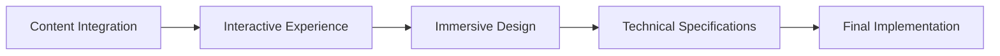

# TravelBlog Specification Documents - Comprehensive Summary

## Overview

This document provides a comprehensive summary of the four specification documents created for the TravelBlog platform. These specifications cover Content Integration, Interactive Experience, Immersive Design, and Technical Requirements, ensuring a holistic approach to the project's development.

## Document Structure

```
plans/
├── Content_Integration_Requirements.md
├── Interactive_Experience_Requirements.md
├── Immersive_Design_Requirements.md
├── Technical_Specifications.md
└── Specification_Summary.md (this document)
```

## 1. Content Integration Requirements

### Key Focus Areas
- **Content Presentation**: Cards, scrollytelling, parallax, and timeline layouts
- **Typography**: Hierarchical font system with Cinzel, Playfair Display, and Lato
- **Media Integration**: Image galleries, video embedding, and interactive media
- **Cross-Linking**: Internal linking strategy and content discovery mechanisms

### Technical Highlights
- **HTML Structure**: Semantic markup for blog posts and journey templates
- **CSS Architecture**: Responsive typography with clamp() functions
- **JavaScript**: Progressive content loading and interactive enhancements
- **Accessibility**: WCAG 2.1 AA compliance for all content

### Implementation Examples
```html
<article class="blog-post">
    <header>
        <h1>Post Title</h1>
        <div class="meta">Date, Author, Tags</div>
    </header>
    <section class="content">
        <p>Content with <em>emphasis</em> and <strong>strong</strong> elements</p>
        <blockquote>Important quote</blockquote>
    </section>
</article>
```

## 2. Interactive Experience Requirements

### Key Focus Areas
- **User Journey**: Entry points, navigation flow, and exit strategies
- **Interactive Elements**: Hover effects, click reveals, and scroll animations
- **Engagement Touchpoints**: Commenting, sharing, bookmarking, and feedback
- **Progress Indicators**: Reading progress, journey tracking, and wayfinding

### Technical Highlights
- **JavaScript Framework**: Modular pattern for interactive components
- **CSS Animations**: Smooth transitions and hover effects
- **Performance**: Debouncing and throttling for optimized interactions
- **Accessibility**: Keyboard navigation and ARIA attributes

### Implementation Examples
```javascript
// Custom cursor with interactive elements
const cursorDot = document.querySelector('.cursor-dot');
const cursorOutline = document.querySelector('.cursor-outline');

window.addEventListener('mousemove', (e) => {
    cursorDot.style.left = `${e.clientX}px`;
    cursorDot.style.top = `${e.clientY}px`;
    
    cursorOutline.animate({
        left: `${e.clientX}px`,
        top: `${e.clientY}px`
    }, { duration: 500, fill: "forwards" });
});
```

## 3. Immersive Design Requirements

### Key Focus Areas
- **Visual Storytelling**: Parallax effects, fade-ins, and slide reveals
- **Atmospheric Elements**: Backgrounds, color transitions, and ambient effects
- **Micro-Interactions**: Feedback mechanisms and interactive states
- **Responsive Behavior**: Device adaptation and performance optimization

### Technical Highlights
- **CSS Architecture**: Layered parallax and animation systems
- **JavaScript Implementation**: Intersection observers and scroll handlers
- **Performance Optimization**: Adaptive loading and resource management
- **Accessibility**: Motion preferences and high contrast modes

### Implementation Examples
```css
/* Parallax layering */
.parallax-layer-1 {
    transform: translateZ(-1px) scale(2);
}

.parallax-layer-2 {
    transform: translateZ(-2px) scale(3);
}

/* Fade-in animation */
.fade-in {
    opacity: 0;
    transform: translateY(20px);
    transition: opacity 0.6s ease-out, transform 0.6s ease-out;
}

.fade-in.visible {
    opacity: 1;
    transform: translateY(0);
}
```

## 4. Technical Specifications

### Key Focus Areas
- **HTML Structure**: Semantic markup and document organization
- **CSS Architecture**: BEM methodology and responsive design
- **JavaScript Functionality**: Core functionality and performance optimization
- **Accessibility Standards**: ARIA attributes and keyboard navigation

### Technical Highlights
- **Build Process**: Webpack bundling and Babel transpilation
- **Performance Benchmarks**: Lighthouse scoring and Web Vitals monitoring
- **Cross-Browser Compatibility**: Feature detection and polyfills
- **Content Management**: Markdown authoring and API integration

### Implementation Examples
```css
/* CSS variables for theming */
:root {
    --color-primary: #d45d00;
    --color-secondary: #3a3532;
    --color-accent: #cfaa6d;
    --font-heading: 'Cinzel', serif;
    --font-body: 'Lato', sans-serif;
}

/* Responsive grid system */
.content-grid {
    display: grid;
    grid-template-columns: repeat(auto-fit, minmax(300px, 1fr));
    gap: var(--spacing-md);
}
```

## 5. Cross-Document Integration

### Shared Principles
- **User-Centric Design**: All specifications prioritize user experience
- **Performance Optimization**: Consistent focus on speed and efficiency
- **Accessibility**: WCAG 2.1 AA compliance across all documents
- **Responsive Design**: Mobile-first approach with progressive enhancement

### Technical Synergies
- **CSS Variables**: Consistent theming across all components
- **JavaScript Modules**: Reusable interactive patterns
- **HTML Semantics**: Unified content structure
- **Animation Systems**: Coordinated motion design

### Implementation Flow


## 6. Performance Requirements

### Loading Performance
- **Time to First Byte**: < 200ms
- **First Contentful Paint**: < 1.5s
- **Largest Contentful Paint**: < 2.5s
- **Time to Interactive**: < 3.5s

### Rendering Performance
- **Frame Rate**: 60fps for all animations
- **Layout Thrashing**: Minimal forced synchronous layouts
- **Memory Usage**: Efficient DOM manipulation
- **Resource Optimization**: WebP images, WOFF2 fonts

### Monitoring & Analytics
- **Lighthouse**: Regular performance audits
- **Web Vitals**: Core metrics monitoring
- **Error Tracking**: Sentry or similar tools
- **User Analytics**: Engagement metric tracking

## 7. Accessibility Compliance

### WCAG 2.1 AA Standards
- **Perceivable**: Text alternatives, adaptable content, distinguishable elements
- **Operable**: Keyboard accessible, enough time, navigable content
- **Understandable**: Readable, predictable, input assistance
- **Robust**: Compatible with current and future technologies

### Implementation Checklist
- [x] Semantic HTML structure
- [x] ARIA attributes for interactive elements
- [x] Keyboard navigation support
- [x] Color contrast compliance (4.5:1 minimum)
- [x] Text resizing support (up to 200%)
- [x] Screen reader compatibility
- [x] Motion preference respect
- [x] Focus indicators for interactive elements

## 8. Implementation Roadmap

### Phase 1: Foundation (2-4 weeks)
- **Content Structure**: HTML templates and CMS integration
- **Base Styles**: CSS variables and typography system
- **Core Interactions**: Basic JavaScript functionality
- **Accessibility Baseline**: ARIA attributes and keyboard navigation

### Phase 2: Enhancement (3-5 weeks)
- **Advanced Layouts**: Grid systems and responsive patterns
- **Interactive Components**: Cards, modals, and animations
- **Performance Optimization**: Image compression and lazy loading
- **Cross-Browser Testing**: Feature detection and polyfills

### Phase 3: Polish (2-3 weeks)
- **Micro-Interactions**: Hover states and feedback mechanisms
- **Immersive Elements**: Parallax and ambient effects
- **Final Testing**: User testing and accessibility audits
- **Documentation**: Code comments and style guides

### Phase 4: Launch & Monitor (Ongoing)
- **Deployment**: CI/CD pipeline and version control
- **Monitoring**: Performance metrics and error tracking
- **Feedback Collection**: User surveys and analytics
- **Continuous Improvement**: Regular updates and optimizations

## 9. Content Alignment

### Spiritual & Cultural Integration
- **Sacred Geometry**: Mandala patterns and temple architecture motifs
- **Color Symbolism**: Traditional color palettes with spiritual significance
- **Typography**: Cinzel for headings (elegant and authoritative)
- **Imagery**: Cultural patterns and sacred symbols

### Journey Narrative Alignment
- **Chronological Flow**: Timeline-based content presentation
- **Geographical Context**: Map integration and location-based content
- **Cultural Depth**: Mythological references and historical context
- **Personal Reflection**: Journal-style storytelling and insights

## 10. Technical Stack Recommendations

### Frontend Technologies
- **HTML5**: Semantic markup and modern elements
- **CSS3**: Advanced selectors, animations, and layouts
- **JavaScript (ES6+)**: Modern JavaScript features
- **Web Components**: Reusable component architecture

### Build Tools
- **Webpack**: Module bundling and optimization
- **Babel**: JavaScript transpilation
- **PostCSS**: CSS processing and optimization
- **ESLint**: Code quality and consistency

### Performance Tools
- **Lighthouse**: Performance auditing
- **Webpack Bundle Analyzer**: Bundle size optimization
- **ImageOptim**: Image compression
- **FontForge**: Font subsetting and optimization

### Testing Frameworks
- **Jest**: JavaScript unit testing
- **Cypress**: End-to-end testing
- **axe**: Accessibility testing
- **BrowserStack**: Cross-browser testing

## 11. Maintenance & Governance

### Code Quality
- **Style Guides**: Consistent coding standards
- **Code Reviews**: Peer review process
- **Documentation**: Comprehensive code comments
- **Version Control**: Git with feature branches

### Content Management
- **Editorial Guidelines**: Content quality standards
- **Update Strategy**: Regular content refresh
- **Backup Strategy**: Content retention and recovery
- **Moderation**: User-generated content review

### Performance Monitoring
- **Regular Audits**: Monthly performance reviews
- **User Feedback**: Continuous improvement process
- **Error Tracking**: Real-time issue detection
- **Optimization**: Ongoing performance enhancements

## 12. Success Metrics

### User Engagement
- **Time on Page**: > 3 minutes average
- **Scroll Depth**: > 75% completion rate
- **Bounce Rate**: < 30% for content pages
- **Return Rate**: > 20% returning visitors

### Performance Metrics
- **Lighthouse Score**: > 90 for all categories
- **Web Vitals**: Good scores for LCP, FID, CLS
- **Load Time**: < 2.5s for main content
- **Error Rate**: < 1% of user sessions

### Business Metrics
- **Sharing Rate**: > 15% content amplification
- **Conversion Rate**: > 5% for key actions
- **Growth Rate**: > 10% monthly user growth
- **Retention Rate**: > 30% monthly active users

## Conclusion

This comprehensive specification framework provides a solid foundation for implementing the TravelBlog platform with a focus on user experience, performance, and accessibility. The four core documents—Content Integration, Interactive Experience, Immersive Design, and Technical Specifications—work together to create a cohesive and engaging digital experience that honors the spiritual and cultural depth of the Odisha Sacred Odyssey content.

### Key Takeaways

1. **User-Centric Approach**: All specifications prioritize the user journey and experience
2. **Performance Focus**: Consistent emphasis on speed, efficiency, and optimization
3. **Accessibility Compliance**: Full WCAG 2.1 AA compliance across all aspects
4. **Cultural Integration**: Deep alignment with spiritual and cultural content themes
5. **Technical Excellence**: Modern web standards and best practices throughout

### Next Steps

1. **Review & Approval**: Stakeholder review of all specification documents
2. **Implementation Planning**: Detailed project timeline and resource allocation
3. **Development Phases**: Sequential implementation following the roadmap
4. **Testing & QA**: Comprehensive testing across all user scenarios
5. **Launch & Monitor**: Deployment with continuous performance monitoring

The TravelBlog platform is poised to deliver an immersive, engaging, and spiritually meaningful experience that showcases the sacred journey through Odisha while setting new standards for digital storytelling in the travel and spirituality domains.